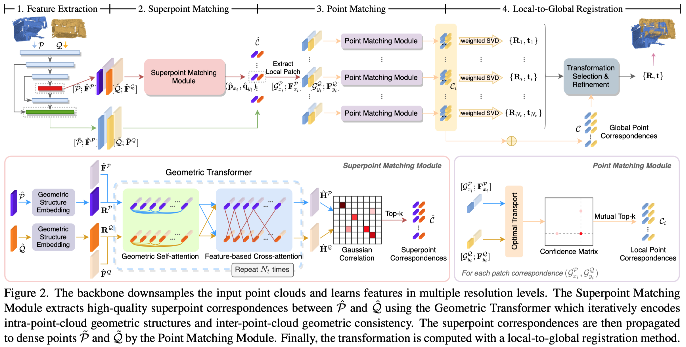

# Geometric Transformer for Fast and Robust Point Cloud Registration

PyTorch implementation of the paper:

Geometric Transformer for Fast and Robust Point Cloud Registration.

Zheng Qin, Hao Yu, Changjian Wang, Yulan Guo, Yuxing Peng, and Kai Xu

## Introduction

We study the problem of extracting accurate correspondences for point cloud registration. Recent keypoint-free methods bypass the detection of repeatable keypoints which is difficult in low-overlap scenarios, showing great potential in registration. They seek correspondences over downsampled superpoints, which are then propagated to dense points. Superpoints are matched based on whether their neighboring patches overlap. Such sparse and loose matching requires contextual features capturing the geometric structure of the point clouds. We propose Geometric Transformer to learn geometric feature for robust superpoint matching. It encodes pair-wise distances and triplet-wise angles, making it robust in low-overlap cases and invariant to rigid transformation. The simplistic design attains surprisingly high matching accuracy such that no RANSAC is required in the estimation of alignment transformation, leading to $100$ times acceleration. Our method improves the inlier ratio by $17\% \sim 30\%$ and the registration recall by over $7\%$ on the challenging 3DLoMatch benchmark.
Code will be released for paper reproduction.



## News

## Installation

Please use the following command for installation.

```bash
# It is recommended to create a new environment
conda create -n geotransformer python==3.8
conda activate geotransformer

# [Optional] If you are using CUDA 11.0 or newer, please install `torch==1.7.1+cu110`
pip install torch==1.7.1+cu110 -f https://download.pytorch.org/whl/torch_stable.html

# Install packages and other dependencies
python setup.py build develop

# Compile c++ wrappers
cd geotransformer/cpp_wrappers
sh ./compile_wrappers.sh
```

Code has been tested with Ubuntu 20.04, GCC 9.3.0, Python 3.8, PyTorch 1.7.1, CUDA 11.1 and cuDNN 8.1.0.

## Data preparation

We provide code for training and testing on 3DMatch.

The dataset can be download from [PREDATOR](https://github.com/overlappredator/OverlapPredator). The data should be organized as follows:

```text
--data--3DMatch--metadata
              |--data--train--7-scenes-chess--cloud_bin_0.pth
                    |      |               |--...
                    |      |--...
                    |--test--7-scenes-redkitchen--cloud_bin_0.pth
                          |                    |--...
                          |--...
```

## Training

The code for GeoTransformer is in `experiments/geotransformer.3dmatch`. Use the following command for training.

```bash
CUDA_VISIBLE_DEVICES=0 python trainval.py
# use "--snapshot=path/to/snapshot" to resume training.
```

## Testing

Use the following command for testing.

```bash
# 3DMatch
CUDA_VISIBLE_DEVICES=0 ./eval.sh EPOCH 3DMatch
# 3DLoMatch
CUDA_VISIBLE_DEVICES=0 ./eval.sh EPOCH 3DLoMatch
```

`EPOCH` is the epoch id.

We also provide pretrained weights in `weights`, use the following command to test the pretrained weights.

```bash
CUDA_VISIBLE_DEVICES=0 python test.py --snapshot=../../weights/geotransformer-3dmatch.pth.tar --benchmark=3DMatch
CUDA_VISIBLE_DEVICES=0 python eval.py --run_matching --run_registration --benchmark=3DMatch
```

Replace `3DMatch` with `3DLoMatch` to evaluate on 3DLoMatch.

## Results

| Benchmark | FMR | IR | RR |
| --------- | --- | -- | -- |
| 3DMatch | 97.7 | 70.3 | 91.5 |
| 3DLoMatch | 88.1 | 43.3 | 74.0 |
